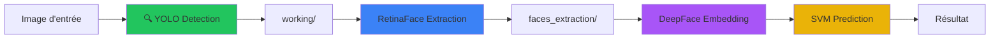

#  AI Models Application Project

Application de reconnaissance faciale professionnelle avec pipeline automatique en 3 étapes : **YOLO** → **RetinaFace** → **Prédiction SVM**.


---

##  Table des matières

- [ Aperçu](#-aperçu)
- [ Fonctionnalités](#-fonctionnalités)
- [ Architecture](#️-architecture)
- [ Installation](#-installation)
- [ Utilisation](#-utilisation)
- [ Structure du projet](#-structure-du-projet)
- [ Pipeline détaillé](#-pipeline-détaillé)
- [ Modèles supportés](#-modèles-supportés)

---

## Aperçu

Ce projet implémente un système **professionnel** de reconnaissance faciale utilisant un pipeline automatique en 3 étapes pour maximiser la précision des prédictions :

1. **YOLO (YOLOv11n)** : Détection des personnes dans l'image
2. **RetinaFace** : Extraction précise des visages
3. **DeepFace + SVM** : Reconnaissance faciale et classification

### Interface graphique moderne

L'application dispose d'une **interface Tkinter professionnelle** avec :

- **Visualisation du pipeline en temps réel** - Widget avec indicateurs colorés pour chaque étape
- **Affichage des détections** - Bounding boxes YOLO (vert) et RetinaFace (bleu) sur les images
- **Barre de confiance visuelle** - Progressbar colorée selon la confiance (vert/jaune/rouge)
- **Traitement batch optimisé** - Processeur multi-thread pour dossiers d'images
- **Logs en temps réel** - Suivi détaillé de chaque étape du pipeline
- **Toggle annotations** - Activer/désactiver l'affichage des détections

---

##  Fonctionnalités

### Pipeline automatique 3 étapes

- ✅ **Détection multi-personnes** : YOLO détecte toutes les personnes dans l'image
- ✅ **Extraction robuste** : RetinaFace extrait les visages avec haute précision
- ✅ **Prédiction SVM** : Classification avec modèles pré-entraînés (ArcFace, VGG-Face)

### Interface utilisateur avancée

- ✅ **Widget de pipeline** : Visualisation en temps réel des 3 étapes (idle/running/success/error)
- ✅ **Annotations visuelles** : Affichage des bounding boxes sur les images
  - 🟢 Rectangles verts pour les personnes (YOLO)
  - 🔵 Rectangles bleus pour les visages (RetinaFace)
  - 🏷️ Nom prédit avec fond coloré selon la confiance
- ✅ **Barre de progression** : Suivi visuel du traitement batch
- ✅ **Logs détaillés** : Statistiques et états à chaque étape
- ✅ **Support multi-backends** : ArcFace, VGG-Face, Facenet, etc.

### Robustesse et performance

- ✅ **Normalisation des noms** : Gère automatiquement les accents et caractères spéciaux
- ✅ **Gestion d'erreurs** : Messages clairs et suggestions à chaque étape
- ✅ **GPU automatique** : Utilise le GPU si disponible (CPU sinon)
- ✅ **Batch processing** : Traitement asynchrone avec threading
- ✅ **Code modulaire** : Architecture propre et maintenable (~350 lignes par fichier)

---

##  Architecture

### Pipeline visuel



### Flux de données complet

1. **Input** : Image ou dossier d'images
2. **YOLO** : Détecte les personnes → crops dans `working/`
3. **RetinaFace** : Extrait les visages → crops dans `faces_extraction/`
4. **DeepFace** : Génère les embeddings des visages
5. **SVM** : Prédit l'identité à partir des embeddings
6. **Output** : Nom prédit + confiance + bounding boxes

### Architecture modulaire

```
src/gui/
├── app.py                      (350 lignes) - Application principale
├── batch_processor.py          (130 lignes) - Traitement batch asynchrone
├── ui_builder.py               (160 lignes) - Construction de l'interface
├── pipeline_status_widget.py   (150 lignes) - Widget de visualisation du pipeline
├── image_annotator.py          (150 lignes) - Annotations sur images
└── constants.py                 (40 lignes) - Constantes de configuration
```

**Avantages** :
- Code organisé en modules spécialisés
- Facilement testable
- Facile à maintenir et étendre
- Composants réutilisables

---

## Installation

### Prérequis

- Python 3.11+
- GPU NVIDIA (optionnel mais recommandé)
- Git

### Étapes

1. **Cloner le repository**

```bash
git clone https://github.com/Ibrahima-Camara20/AI_Models_Application_Project.git
cd AI_Models_Application_Project
```

2. **Créer un environnement virtuel**

```bash
python -m venv .venv
source .venv/Scripts/activate  # Windows Git Bash
# ou
.venv\Scripts\activate.bat     # Windows CMD
# ou
source .venv/bin/activate      # Linux/Mac
```

3. **Installer les dépendances**

```bash
pip install -r requirements.txt
```

4. **Télécharger le modèle YOLO**

Le modèle `yolo11n.pt` sera téléchargé automatiquement au premier lancement.

---

##  Utilisation

### Lancer l'interface graphique

```bash
python -m src.main
```

### Workflow utilisateur

#### Mode Image Unique

1. **Charger un modèle** : Cliquez sur "Parcourir" et sélectionnez votre fichier `.pkl`
2. **Sélectionner le backend** : Choisissez ArcFace ou VGG-Face
3. **Choisir une image** : "Choisir une image"
4. **Prédire** : Cliquez sur "Prédire"

→ L'image s'affiche avec les bounding boxes et le nom prédit

#### Mode Batch (Dossier)

1. **Charger un modèle** : Sélectionnez votre `.pkl`
2. **Choisir un dossier** : "Choisir un dossier"
3. **Prédire** : Cliquez sur "Prédire" pour lancer le batch

→ Le widget de pipeline s'anime pour chaque image

### Fonctionnalités de l'interface

**Visualisation du pipeline** :
- Gris (Idle) - En attente
- Jaune (Running) - En cours
- Vert (Success) - Terminé avec succès
- Rouge (Error) - Erreur

**Toggle des annotations** :
- ☑️ Coché : Affiche les bounding boxes sur l'image
- ☐ Décoché : Affiche l'image originale

**Barre de confiance** :
- 🟢 Vert (≥ 80%) - Haute confiance
- 🟡 Jaune (50-80%) - Confiance moyenne
- 🔴 Rouge (< 50%) - Faible confiance

### Exemple de sortie

```
[RUN] Pipeline Single Image | Backend=ArcFace | file=emma_watson.jpg

[PIPELINE] Étape 1/3 : Détection YOLO...
[PIPELINE] ✓ Personnes détectées : 2

[PIPELINE] Étape 2/3 : Extraction RetinaFace...
[PIPELINE] ✓ Visages détectés : 2

[PIPELINE] Étape 3/3 : Prédiction...
[PIPELINE] ✓ Prédiction terminée

[INFO] filename_prefix=emma watson
[INFO] predicted=Emma Watson
[OK] status=OK
```

**Résultat visuel** :
- Rectangle vert autour de la personne (YOLO)
- Rectangle bleu autour du visage (RetinaFace)
- Texte "Emma Watson (92.3%)" avec fond vert

---

##  Structure du projet

```
AI_Models_Application_Project/
├── src/                        # Code source principal
│   ├── core/                   # Logique métier
│   │   ├── pipeline.py         # Orchestrateur du pipeline 3 étapes
│   │   ├── predictor.py        # Prédiction DeepFace + SVM
│   │   ├── model_loader.py     # Chargement des modèles .pkl
│   │   ├── text_utils.py       # Normalisation et comparaison de noms
│   │   └── path_utils.py       # Gestion des dossiers temporaires
│   │
│   ├── gui/                    # Interface graphique (modulaire)
│   │   ├── app.py              # Application principale (350 lignes)
│   │   ├── batch_processor.py  # Traitement batch asynchrone (130 lignes)
│   │   ├── ui_builder.py       # Construction de l'UI (160 lignes)
│   │   ├── pipeline_status_widget.py  # Widget pipeline (150 lignes)
│   │   ├── image_annotator.py  # Annotations images (150 lignes)
│   │   └── constants.py        # Configuration UI (40 lignes)
│   │
│   └── main.py                 # Point d'entrée de l'application
│
├── pre/                        # Scripts de prétraitement
│   ├── yolo_detection.py       # Détection YOLO (270 lignes)
│   ├── retinaface_extraction.py # Extraction RetinaFace (190 lignes)
│   ├── deep_face_prediction.py # Prédiction simple
│   └── arc_face_fast_prediction.py # Prédiction optimisée batch
│
├── working/                    # Dossier temporaire (crops YOLO)
├── faces_extraction/           # Dossier temporaire (visages RetinaFace)
│
├── img/                        # Données d'exemple
│   ├── celebrity_db_cropped/   # Base de données de visages
│   └── stats/                  # Statistiques de performance
│
├── requirements.txt            # Dépendances Python
├── .gitignore                  # Fichiers ignorés par Git
└── README.md                   # Ce fichier
```

---

##  Pipeline détaillé

### Étape 1 : YOLO Detection 🔍

**Objectif** : Détecter toutes les personnes dans l'image

- **Modèle** : YOLOv11n (nano - rapide et léger)
- **Classe** : Person (classe 0)
- **Sortie** : Crops des personnes → `working/`
- **Format** : `{filename}-person-{id}-bb-{x1}-{y1}-{x2}-{y2}.jpg`
- **Normalisation** : Noms de fichiers sans accents ni caractères spéciaux

**Exemple** :
```
input:  team_photo.jpg
output: working/team_photo-person-0-bb-100-200-300-400.jpg
        working/team_photo-person-1-bb-350-200-550-400.jpg
```

**Retour** : Liste de bounding boxes `[(x1, y1, x2, y2, confidence), ...]`

### Étape 2 : RetinaFace Extraction 👤

**Objectif** : Extraire le visage principal de chaque personne

- **Modèle** : RetinaFace (détection faciale précise)
- **Stratégie** : Sélection du plus gros visage (max area)
- **Sortie** : Visages extraits → `faces_extraction/`
- **GPU** : Utilise automatiquement le GPU si disponible

**Exemple** :
```
input:  working/team_photo-person-0-bb-100-200-300-400.jpg
output: faces_extraction/team_photo-person-0-bb-100-200-300-400.jpg
```

**Retour** : Liste de bounding boxes faciales `[(x1, y1, x2, y2), ...]`

### Étape 3 : Prédiction 

**Objectif** : Reconnaître l'identité du visage

- **Embedding** : DeepFace (ArcFace ou VGG-Face)
  - ArcFace : État de l'art, très précis
  - VGG-Face : Plus rapide, bon compromis
- **Classification** : SVM linéaire pré-entraîné
- **Sortie** : Nom prédit + confiance (0-1)

**Processus** :
1. Charger le visage depuis `faces_extraction/`
2. Générer l'embedding avec DeepFace
3. Prédire avec le modèle SVM
4. Retourner le nom et la confiance

---

##  Modèles supportés

### Embeddings (DeepFace)

-  **ArcFace** (recommandé) - Précision maximale, état de l'art
-  **VGG-Face** - Bon compromis vitesse/précision
-  **Facenet** - Alternative performante
-  **OpenFace** - Léger et rapide

### Détection

- **YOLOv11n** - Détection de personnes ultra-rapide
- **RetinaFace** - Extraction faciale de haute précision

### Classification

- **SVM** - Classification rapide et efficace
- 📈 Entraînable sur vos propres données

---
