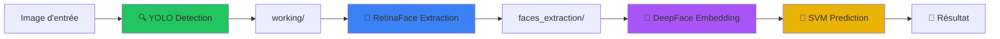

# AI Models Application Project

Application de reconnaissance faciale professionnelle avec pipeline automatique : **YOLO** → **RetinaFace** → **Prédiction SVM**.


---

## 🚀 Installation

```bash
# 1. Cloner le projet
git clone https://github.com/Ibrahima-Camara20/AI_Models_Application_Project.git
cd AI_Models_Application_Project

# 2. Créer l'environnement virtuel
python -m venv .venv
# Windows:
.venv\Scripts\activate
# Linux/Mac:
source .venv/bin/activate

# 3. Installer les dépendances
pip install -r requirements.txt
```

---

## 🖥️ Utilisation

Le projet propose deux modes d'utilisation : Interface Graphique (GUI) et Ligne de Commande (CLI).

### 1. Interface Graphique (GUI)

Lance une interface moderne pour visualiser le pipeline en temps réel.

```bash
python -m src.gui_main
```

_Fonctionnalités : Visualisation du pipeline, mode image unique ou batch, annotations visuelles._

### 2. Ligne de Commande (CLI)

Exécute le pipeline complet (Détection -> Extraction -> Identification) sur les images de test.

```bash
python -m src.cli_main
```

_Pipeline par défaut : `test_images/` → `working/` → `faces_extraction/` → Identification (ArcFace)._

---

## ⚙️ Architecture du Pipeline



---

## 📂 Structure du Projet

```
AI_Models_Application_Project/
├── src/
│   ├── gui_main.py             # Point d'entrée GUI
│   ├── cli_main.py             # Point d'entrée CLI
│   ├── gui/                    # Code de l'interface (Tkinter)
│   └── core/                   # Logique métier (Pipeline, Predictor)
├── pre/                        # Modules de traitement (YOLO, RetinaFace, SVM)
├── working/                    # Crops temporaires (Personnes)
├── faces_extraction/           # Crops temporaires (Visages)
├── test_images/                # Images d'entrée pour la CLI
├── models/                     # Modèles entraînés (.pkl)
└── requirements.txt            # Dépendances
```
