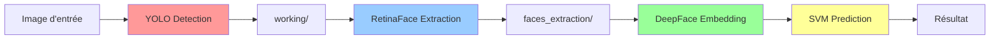

#  AI Models Application Project

Application de reconnaissance faciale avec pipeline automatique en 3 étapes : YOLO → RetinaFace → Prédiction SVM.


---

##  Table des matières

- [Aperçu](#aperçu)
- [Fonctionnalités](#fonctionnalités)
- [Architecture](#architecture)
- [Installation](#installation)
- [Utilisation](#utilisation)
- [Structure du projet](#structure-du-projet)
- [Pipeline détaillé](#pipeline-détaillé)
- [Modèles supportés](#modèles-supportés)
- [Contribution](#contribution)

---

## Aperçu

Ce projet implémente un système complet de reconnaissance faciale utilisant un pipeline automatique en 3 étapes pour améliorer la précision des prédictions :

1. **YOLO (YOLOv11n)** : Détection des personnes dans l'image
2. **RetinaFace** : Extraction précise des visages
3. **DeepFace + SVM** : Reconnaissance faciale et classification

### Interface graphique

L'application dispose d'une interface Tkinter intuitive permettant :
- Prédiction sur une seule image
- Traitement batch de dossiers (avec support récursif)
- Logs en temps réel du pipeline
- Affichage des statistiques de détection

---

## Fonctionnalités

### Pipeline automatique
- ✅ **Détection multi-personnes** : YOLO détecte toutes les personnes dans l'image
- ✅ **Extraction robuste** : RetinaFace extrait les visages avec haute précision
- ✅ **Prédiction SVM** : Classification avec modèles pré-entraînés

### Interface utilisateur
- ✅ **Logs en temps réel** : Suivi détaillé de chaque étape du pipeline
- ✅ **Traitement batch** : Traite automatiquement tous les sous-dossiers
- ✅ **Statistiques** : Affiche le nombre de personnes et visages détectés
- ✅ **Support multi-modèles** : ArcFace, VGG-Face, Facenet, etc.

### Robustesse
- ✅ **Normalisation des noms** : Gère automatiquement les accents et caractères spéciaux
- ✅ **Gestion d'erreurs** : Messages clairs à chaque étape du pipeline
- ✅ **Compatibilité GPU** : Utilise automatiquement le GPU si disponible

---

##  Architecture



### Flux de données

1. **Input** : Image ou dossier d'images
2. **YOLO** : Détecte les personnes → crops sauvegardés dans `working/`
3. **RetinaFace** : Extrait les visages → crops sauvegardés dans `faces_extraction/`
4. **DeepFace** : Génère les embeddings des visages
5. **SVM** : Prédit l'identité à partir des embeddings
6. **Output** : Nom prédit + confiance

---

## Installation


### Étapes

1. **Cloner le repository**

```bash
git clone https://github.com/Ibrahima-Camara20/AI_Models_Application_Project.git
cd AI_Models_Application_Project
```

2. **Créer un environnement virtuel**

```bash
python -m venv .venv
source .venv/Scripts/activate  # Windows Git Bash
# ou
.venv\Scripts\activate.bat     # Windows CMD
```

3. **Installer les dépendances**

```bash
pip install -r requirements.txt
```

4. **Télécharger le modèle YOLO**

Le modèle `yolo11n.pt` sera téléchargé automatiquement au premier lancement.

---

## Utilisation

### Lancer l'interface graphique

```bash
python -m interface.main
```

### Workflow

1. **Charger un modèle** : Cliquez sur "Parcourir" et sélectionnez votre fichier `.pkl`
2. **Sélectionner le backend** : Choisissez le modèle d'embedding (ArcFace, VGG-Face, etc.)
3. **Choisir une image ou un dossier** :
   - Image unique : "Choisir une image"
   - Batch : "Choisir un dossier" (traite automatiquement les sous-dossiers)
4. **Prédire** : Cliquez sur "Prédire" et suivez les logs

### Exemple de sortie

```
[RUN] Pipeline Single Image | Backend=VGG-Face | file=team.jpg
[PIPELINE] Étape 1/3 : Détection YOLO...
[PIPELINE] ✓ Personnes détectées : 17
[PIPELINE] Étape 2/3 : Extraction RetinaFace...
[PIPELINE] ✓ Visages détectés : 17
[PIPELINE] Étape 3/3 : Prédiction...
[PIPELINE] ✓ Prédiction terminée
[INFO] predicted=Cristiano Ronaldo
[OK] status=OK
```

---

## Structure du projet

```
AI_Models_Application_Project/
├── interface/                  # Interface graphique
│   ├── core/
│   │   ├── pipeline.py        # Orchestrateur du pipeline
│   │   ├── predictor.py       # Prédiction DeepFace + SVM
│   │   ├── model_loader.py    # Chargement des modèles
│   │   ├── text_utils.py      # Utilitaires texte
│   │   └── path_utils.py      # Gestion des dossiers
│   ├── gui/
│   │   ├── app.py             # Application Tkinter
│   │   └── constants.py       # Configuration UI
│   └── main.py                # Point d'entrée
├── pre/                        # Scripts de prétraitement
│   ├── yolo_detection.py      # Détection YOLO
│   ├── retinaface_extraction.py # Extraction RetinaFace
│   └── ...
├── src/                        # Scripts d'entraînement
├── working/                    # Dossier temporaire (crops YOLO)
├── faces_extraction/           # Dossier temporaire (visages)
├── requirements.txt            # Dépendances
|
└── README.md                   # Ce fichier
```

---

##  Pipeline détaillé

### Étape 1 : YOLO Detection

**Objectif** : Détecter toutes les personnes dans l'image

- **Modèle** : YOLOv11n (nano)
- **Classe** : Person (classe 0)
- **Sortie** : Crops des personnes → `working/`
- **Normalisation** : Les noms de fichiers sont normalisés (accents enlevés)

**Exemple** :
```
input: team_photo.jpg
output: working/team_photo-person-0-bb-100-200-300-400.jpg
        working/team_photo-person-1-bb-350-200-550-400.jpg
        ...
```

### Étape 2 : RetinaFace Extraction

**Objectif** : Extraire le visage principal de chaque personne

- **Modèle** : RetinaFace
- **Stratégie** : Sélection du plus gros visage (max area)
- **Sortie** : Visages extraits → `faces_extraction/`

**Exemple** :
```
input: working/team_photo-person-0-bb-100-200-300-400.jpg
output: faces_extraction/team_photo-person-0-bb-100-200-300-400.jpg
```

### Étape 3 : Prédiction

**Objectif** : Reconnaître l'identité du visage

- **Embedding** : DeepFace (ArcFace, VGG-Face, etc.)
- **Classification** : SVM pré-entraîné
- **Sortie** : Nom prédit + confiance

---

## Modèles supportés

### Embeddings (DeepFace)


 **ArcFace** 
 **VGG-Face** 


